# MoneyKeeper — Руководство пользователя

Полное описание возможностей приложения и инструкции по работе с ним.

---

## Содержание

1. [Обзор экранов](#обзор-экранов)
2. [Счета](#счета)
3. [Транзакции](#транзакции)
4. [Категории](#категории)
5. [Бюджеты](#бюджеты)
6. [Аналитика и история](#аналитика-и-история)
7. [Прогнозы](#прогнозы)
8. [Уведомления и повторяющиеся операции](#уведомления-и-повторяющиеся-операции)
9. [Настройки](#настройки)
10. [Безопасность и резервные копии](#безопасность-и-резервные-копии)

---

## Обзор экранов

Нижняя панель содержит пять вкладок:

| Иконка | Экран | Назначение |
|--------|-------|-----------|
| Дом | **Главная** | Общий баланс, карусель счетов, сводка за месяц, последние операции |
| Карточка | **Счета** | Список всех счетов, создание новых, перевод между счетами |
| Копилка | **Бюджеты** | Лимиты расходов по категориям и счетам |
| Столбики | **Аналитика** | История операций с фильтрами, диаграммы, разбивка по категориям и счетам |
| График | **Прогноз** | Прогноз балансов с учётом регулярных платежей и вкладов |

Шестерёнка в правом верхнем углу главного экрана открывает **Настройки** (категории, безопасность, экспорт, резервные копии).

Плавающая кнопка **«+»** над нижней панелью открывает форму добавления операции.

<p align="center">
  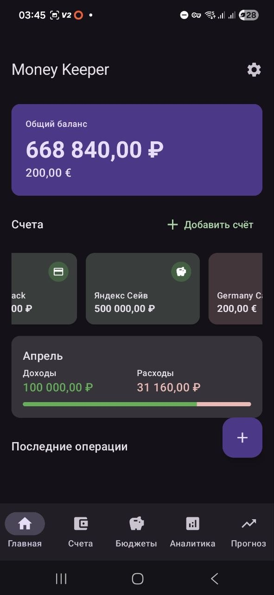
  &nbsp;
  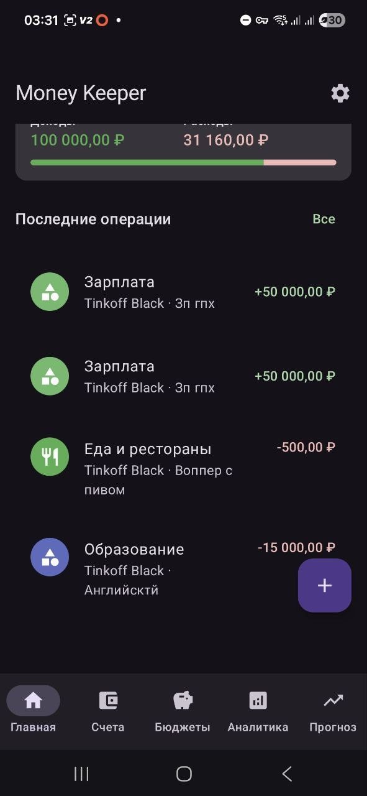
</p>

---

## Счета

### Типы счетов

| Тип | Когда использовать |
|-----|--------------------|
| **Карта** | Банковская карта, расчётный счёт |
| **Наличные** | Кошелёк, наличные деньги |
| **Накопительный счёт** | Вклад без фиксированной даты окончания (проценты начисляются бессрочно) |
| **Срочный вклад (Депозит)** | Вклад с датой окончания; прогноз автоматически учитывает выплату |
| **Инвестиции** | Брокерский счёт или другие инвестиции |
| **Другое** | Всё остальное |

### Как добавить счёт

1. Перейди на вкладку **«Счета»** (иконка карточки).
2. Нажми **«+»** (FAB).
3. Заполни:
   - **Название** — любое, например «Тинькофф» или «Кошелёк»
   - **Тип** — выбери из списка выше
   - **Валюта** — RUB, USD, EUR и т.д.
   - **Цвет** — выбери из палитры; цвет отображается в карусели на главной и в аналитике
   - **Иконка** — выбери подходящую иконку (банк, кошелёк, карта и т.д.)
   - **Начальный баланс** — текущий остаток, с которого начинается учёт
4. Нажми **✓** (сохранить).

### Срочный вклад — дополнительные параметры

При типе **«Депозит»** появляется секция вклада:

| Поле | Описание |
|------|----------|
| **Сумма вклада** | Внесённая сумма (principal) |
| **Процентная ставка** | Годовая ставка в % |
| **Дата открытия** | Когда открыт вклад |
| **Дата окончания** | Когда вклад закрывается |
| **Капитализация** | Вкл/выкл; при включении проценты добавляются к телу |
| **Период капитализации** | Ежемесячно / ежеквартально / ежегодно |
| **Счёт для выплаты** | Куда перечислить сумму при окончании (необязательно) |

Поддерживается **ступенчатая ставка**: можно добавить несколько периодов с разными процентами (например, первый месяц 15%, далее 14%). Чтобы переключиться обратно на одну ставку — кнопка «Использовать единую ставку».

В форме сразу виден **живой прогноз** итоговой суммы.

<p align="center">
  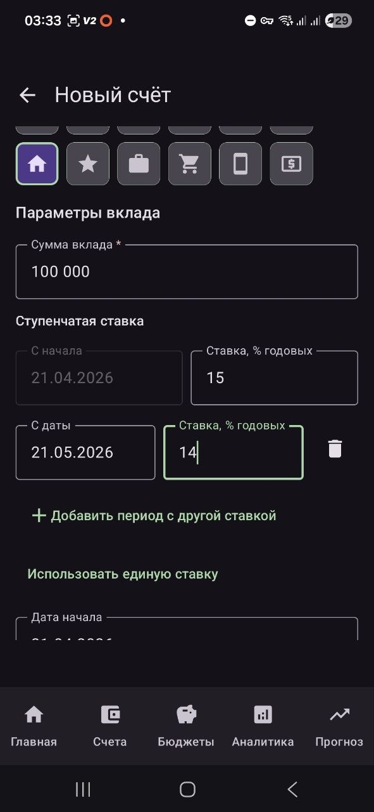
  &nbsp;
  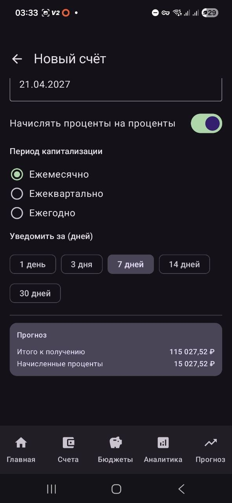
</p>

### Накопительный счёт

Тип **«Накопительный счёт»** — это вклад без даты окончания. Баланс показывается как
«principal + накопленные проценты на сегодня». Прогноз учитывает начисление процентов
вплоть до выбранной даты.

### Редактирование и архивирование

- **Нажми на счёт** → откроется детальный экран.
- **Меню ⋮ на карточке счёта** → «Редактировать» или «Архивировать».
- **Свайп влево** по счёту в списке — удаление (необратимо, удалятся все транзакции этого счёта).
- Нельзя удалить счёт, на который есть незавершённые прогнозы — сначала закрой вклад.

### Архив и восстановление

Архивирование скрывает счёт из основных списков, карусели и сводок, но **не удаляет** его — транзакции этого счёта остаются в базе, просто не видны.

- Чтобы увидеть архивные счета, нажми иконку «глаз» в правом верхнем углу экрана «Счета».
- Архивный счёт отмечен меткой «архив» рядом с названием.
- В меню ⋮ архивного счёта появляется пункт **«Восстановить»** — счёт снова становится активным, его транзакции возвращаются в историю и аналитику.

### Перевод между счетами

1. Открой любой счёт.
2. Нажми **«Перевод»**.
3. Выбери счёт-получатель и сумму.

Перевод фиксируется как транзакция типа **TRANSFER** и корректирует балансы обоих счетов.

---

## Транзакции

### Добавление операции

Нажми **«+»** в нижней панели. Форма содержит:

1. **Тип операции** — Доход / Расход / Перевод / В накопления
2. **Числовая клавиатура** — вводи сумму; разделитель копеек — запятая
3. **Счёт** — откуда списывается (или куда начисляется) сумма
4. **Категория** — выбери из списка или создай новую
5. **Дата** — по умолчанию сегодня; нажми чтобы изменить
6. **Заметка** — необязательный комментарий
7. **Повтор** — настрой регулярное правило (см. ниже)

Нажми **ОК** на клавиатуре или кнопку подтверждения.

<p align="center">
  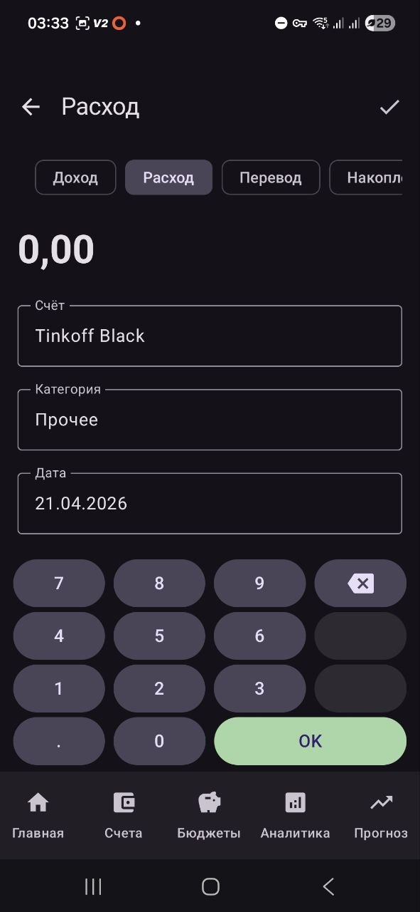
</p>

### Редактирование и удаление

- В **истории** нажми на транзакцию → откроется форма редактирования.
- В **истории** свайп влево → удалить одну операцию.
- Включи **режим выбора** (зажми транзакцию) → выбери несколько → удали пакетом.

### Типы операций

| Тип | Что делает |
|-----|-----------|
| **Доход** | Увеличивает баланс счёта |
| **Расход** | Уменьшает баланс счёта |
| **Перевод** | Уменьшает один счёт, увеличивает другой |
| **В накопления** | Списывает с обычного счёта и записывает как «экономию» (тип расхода без категории трат) |

---

## Категории

Категории используются для классификации доходов и расходов.

### Как добавить / изменить категорию

**Настройки → Категории** или нажми **«+»** в CategoryPicker при создании транзакции.

Форма:
1. **Название** — произвольное
2. **Тип** — Доход / Расход / Перевод
3. **Цвет** — 19 вариантов
4. **Иконка** — 18 вариантов (еда, транспорт, здоровье, дом и т.д.)
5. **Родительская категория** — необязательно; создаёт подкатегорию (не более двух уровней)

<p align="center">
  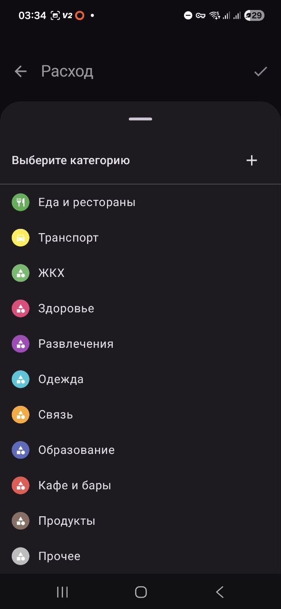
</p>

### Иконки категорий

Иконки отображаются везде, где показывается категория:
- Список категорий в настройках
- CategoryPicker при добавлении транзакции
- Последние операции на главной
- Разбивка по категориям в аналитике

<p align="center">
  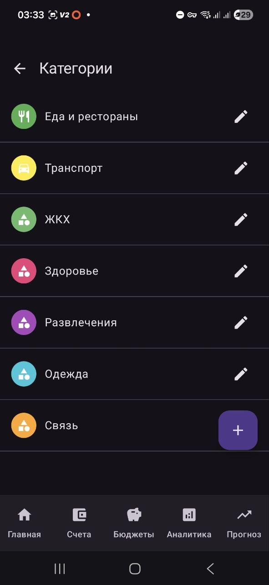
</p>

### Удаление категории

Свайп влево на категории в списке. При удалении категории транзакции с ней **не удаляются** — их поле «категория» просто становится пустым.

---

## Бюджеты

Бюджет — это лимит расходов на выбранный период по выбранным категориям и счетам.

### Как создать бюджет

**Настройки → Бюджеты → «+»**

1. **Лимит** — максимальная сумма расходов
2. **Период** — Ежемесячно или Еженедельно
3. **Категории** — выбери «Все категории» или отметь конкретные (можно несколько)
4. **Счета** — выбери «Все счета» или отметь конкретные (можно несколько)

### Как читать карточку бюджета

```
Еда, Транспорт          [редактировать] [удалить]
Все счета
1 234,00 / 5 000,00
████████░░░░░░░░░░░░  (прогресс-бар зелёный или красный)
```

- **Зелёный** прогресс-бар — лимит не превышен
- **Красный** прогресс-бар — лимит превышен
- Сумма слева — потрачено за текущий период, справа — лимит; рядом — валюта бюджета
- Ниже — доля в процентах (красная, если лимит пробит)

Бюджет привязан к **одной валюте**: расходы по счетам в других валютах не учитываются. Для USD и RUB создавай отдельные бюджеты.

<p align="center">
  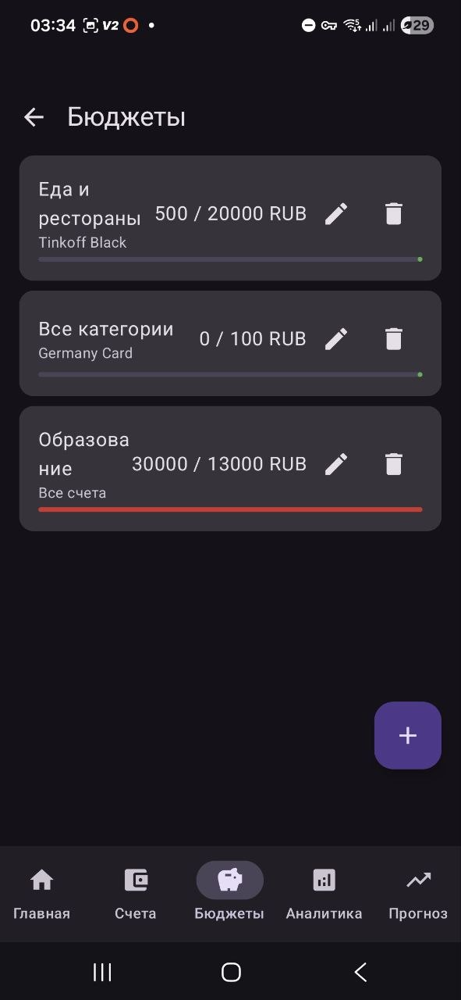
</p>

---

## Аналитика и история

### История операций

Вкладка **«История»** (иконка списка).

**Фильтры** (кнопка воронки):
- Тип: Доход / Расход / Перевод
- Период: текущий месяц, прошлый, 3 месяца, 6 месяцев, год, свой диапазон
- Счёт: один или несколько
- Категория: одна или несколько

**Режим выбора** — зажми транзакцию, отмети нужные, удали пакетом.

**Группировка** — операции сгруппированы по дням, в заголовке дня — итоговая сумма.

<p align="center">
  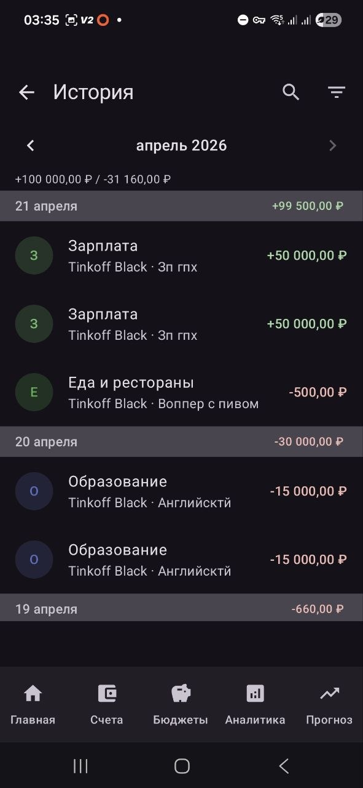
</p>

### Аналитика

Вкладка **«Аналитика»**.

**Переключатель периода** — стрелки влево/вправо для навигации по месяцам.

**Переключатель режима** — «По категориям» или «По счетам».

#### Режим «По категориям»

- **Круговая диаграмма** расходов
- **Топ расходов** — список категорий с прогресс-баром, долей и количеством операций
- **Топ доходов** — аналогично
- **Среднедневной расход** — в нижней части

<p align="center">
  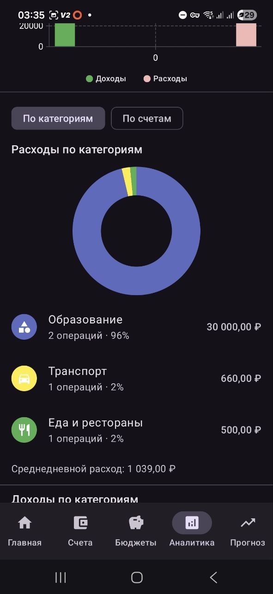
</p>

Нажми на категорию → откроется **детализация**: тренд расходов по категории за 6 месяцев (столбчатый график).

#### Режим «По счетам»

Список счетов с суммой расходов/доходов, прогресс-баром (в цвете счёта) и долей в процентах.

#### Столбчатый график трендов

В верхней части аналитики — **график за 12 месяцев**: зелёные столбики — доходы, красные — расходы.

---

## Прогнозы

Вкладка **«Прогнозы»** (иконка графика).

### Как пользоваться

1. Выбери **дату прогноза** (быстрые пресеты: +1 мес, +3 мес, +6 мес, +1 год, или точная дата).
2. Приложение рассчитывает, каким будет баланс каждого счёта к этой дате.

### Что учитывается

| Событие | Откуда берётся |
|---------|----------------|
| Регулярные платежи/доходы | Правила повторяющихся операций |
| Окончание срочного вклада | Дата окончания вклада + итоговая сумма |
| Проценты по накопительному счёту | Начисление до выбранной даты |

### Итоговая таблица

Каждый счёт — строка с иконкой, цветом счёта и прогнозным балансом. Ниже — итоги по валютам.

### Лента событий

Хронологический список всех событий между сегодня и выбранной датой: когда, что, на какую сумму и какой счёт затронут. Иконка и цвет счёта помогают быстро ориентироваться.

<p align="center">
  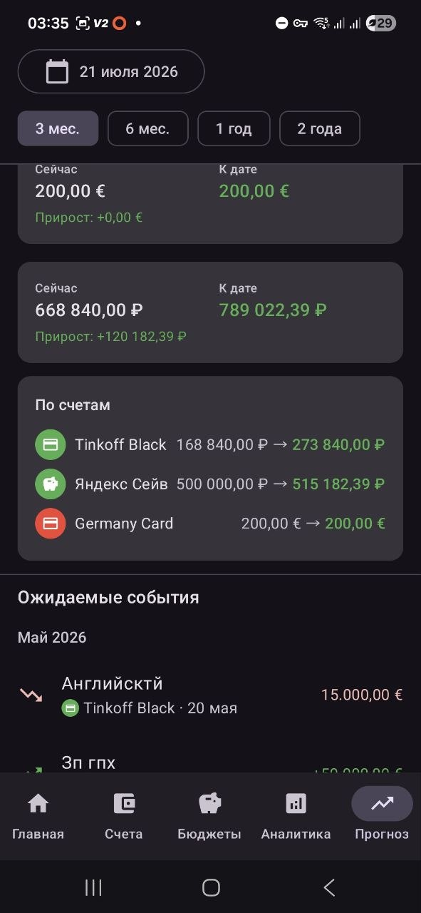
</p>

---

## Уведомления и повторяющиеся операции

### Повторяющиеся операции

При создании транзакции нажми **«Повтор»**:

| Поле | Описание |
|------|---------|
| **Частота** | Ежедневно / Еженедельно / Ежемесячно / Ежегодно |
| **Интервал** | Каждые N единиц (например, каждые 2 недели) |
| **Дата окончания** | Когда прекратить генерацию (необязательно) |

Приложение автоматически создаёт транзакции в нужные даты (в том числе за пропущенные, если приложение было закрыто).

### Уведомления

**Настройки → Уведомления**:

- **Уведомления о вкладах** — напоминание за N дней до окончания вклада
- **Повторяющиеся операции** — напоминание о запланированных платежах
- **Время уведомлений** — в какое время приходит уведомление (по умолчанию 08:00)

Уведомления работают через WorkManager — приходят даже если приложение не открыто, при условии что разрешение `POST_NOTIFICATIONS` выдано.

---

## Настройки

### Основные

| Настройка | Описание |
|-----------|---------|
| **Валюта по умолчанию** | Валюта, которая показывается первой в мульти-валютном балансе |
| **Тема оформления** | Системная / Светлая / Тёмная |

### Категории

**Настройки → Категории** — создание, редактирование, удаление категорий для операций.

### Бюджеты

**Настройки → Бюджеты** — лимиты расходов по категориям и счетам.

### Экспорт в CSV

**Настройки → Резервная копия → Экспорт в CSV**

Выгрузка всех операций в файл `.csv` с разделителем `;` (совместим с Excel и Google Таблицами). Первая строка — заголовки, кодировка UTF-8 с BOM.

### Журнал ошибок

**Настройки → О приложении → Отправить логи**

Если приложение падало — здесь можно поделиться файлом с подробностями ошибки для диагностики. Отправляется через стандартный системный шаринг (Telegram, email и т.д.).

---

## Безопасность и резервные копии

### Мастер-пароль

Приложение защищено **мастер-паролем**, который устанавливается при первом запуске.
Пароль шифрует базу данных через Argon2id + AES-256. **Без пароля данные недоступны**.

<p align="center">
  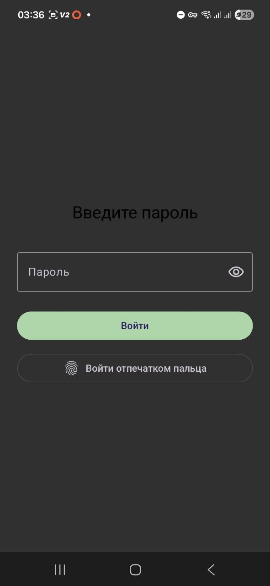
</p>

### Смена пароля

**Настройки → Безопасность → Сменить пароль**

Введи текущий пароль и дважды — новый. После смены:
- Старые резервные копии по-прежнему расшифровываются **старым** паролем.
- Биометрия автоматически отключается и требует повторной настройки.

### Биометрия

**Настройки → Безопасность → Биометрическая разблокировка**

Вход по отпечатку пальца или Face ID вместо ввода пароля. Биометрия — только для разблокировки приложения; резервные копии всегда шифруются паролем.

Биометрия инвалидируется автоматически, если:
- Смениешь пароль в приложении
- Добавишь новый отпечаток в настройках телефона

В обоих случаях нужно включить биометрию заново.

### Резервные копии

**Настройки → Резервная копия**

#### Создать резервную копию

Сохраняет зашифрованный файл `.mkbak`. Без мастер-пароля файл открыть невозможно.

<p align="center">
  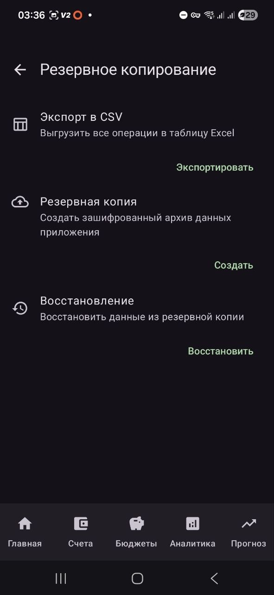
</p>

Рекомендуется хранить копию:
- В Telegram «Избранное»
- Google Drive / Яндекс.Диск
- На компьютере

#### Восстановить из резервной копии

Выбери `.mkbak`-файл и введи мастер-пароль, который был **в момент создания** копии (не обязательно текущий).

#### Перенос на новое устройство

1. Создай резервную копию на старом устройстве.
2. Установи приложение на новом.
3. Пройди первый запуск (создай любой пароль).
4. **Настройки → Резервная копия → Восстановить** → выбери файл → введи **старый** пароль.
5. Приложение перезапустится с восстановленными данными.

---

## Быстрые ответы

**Можно ли вести несколько валют одновременно?**  
Да. Каждый счёт имеет свою валюту. На главной экране баланс показывается отдельной строкой для каждой валюты.

**Почему нет синхронизации с другими устройствами?**  
Приложение хранит данные только локально — это гарантирует, что финансовые данные не попадут на сторонние серверы. Для переноса используй резервные копии.

**Что будет, если удалить приложение?**  
Данные будут удалены вместе с приложением. Восстановить их можно только из предварительно созданной резервной копии.

**Что будет, если забыть пароль?**  
Данные безвозвратно недоступны — пароль нигде не хранится и не восстанавливается. Единственная защита — регулярные резервные копии.

**Что такое «В накопления» тип операции?**  
Это расход, который учитывается отдельно от обычных трат. Полезно, чтобы не смешивать «откладываю деньги» и «трачу деньги» в аналитике.
